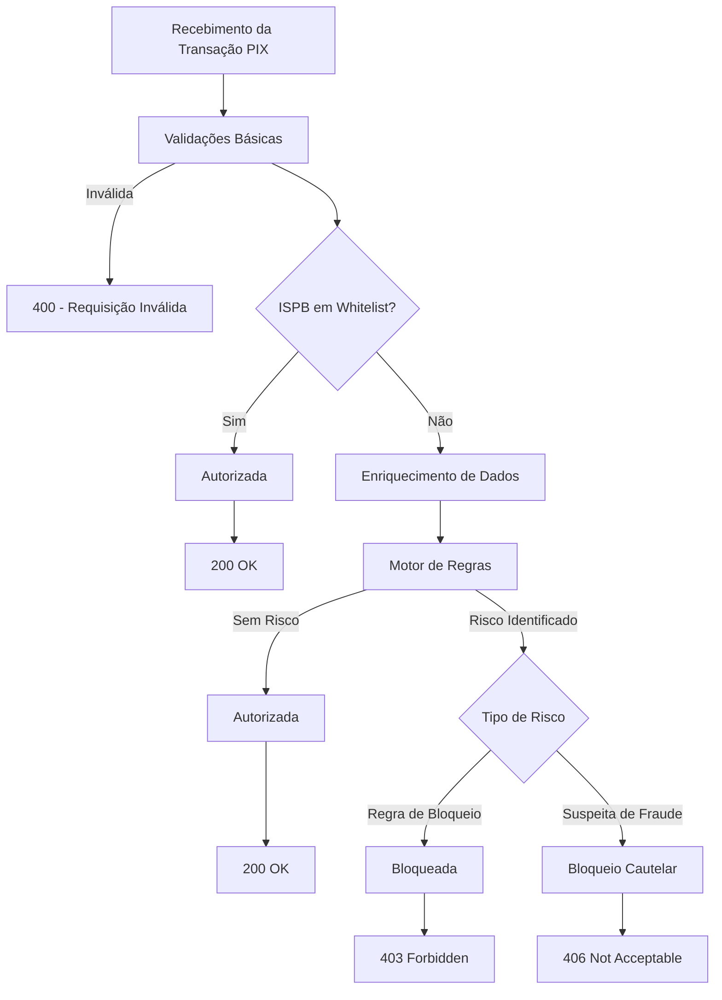

Plataforma Anti-Fraude da Celcoin

 

# Visão Geral

O **Follow the Money** é o motor antifraude de autorização da plataforma, responsável por avaliar transações **PIX em tempo real** e decidir, com base em regras configuráveis, se uma transação deve ser:

* Autorizada
* Bloqueada
* Submetida a bloqueio cautelar

O serviço atua como uma **camada central de controle de risco**, integrada aos fluxos críticos de pagamento e alinhada às diretrizes regulatórias aplicáveis.

# Fluxo de Autorizações

O processo de autorização segue as etapas abaixo:

1. **Recebimento da transação**
   * A transação PIX é recebida para avaliação.

2. **Validações básicas**
   * Campos obrigatórios
   * Valor válido (maior que zero)

3. **Avaliação de whitelist de ISPB**
   * Quando aplicável, transações de ISPBs confiáveis são autorizadas automaticamente.

4. **Enriquecimento de dados**
   * Dados de conta
   * Sinais de fraude
   * Informações de devoluções

5. **Avaliação pelo motor de regras**
   * Aplicação das regras de risco e negócio configuradas.

6. **Retorno da decisão**
   * Autorização, bloqueio ou bloqueio cautelar.

# Tipos de Decisões

## 1. Autorizada

Retornada quando a transação atende a todas as validações e não viola nenhuma regra de bloqueio.

* **Status HTTP:** `200 OK`
* **authorized:** `true`

## 2. Bloqueada

Retornada quando a transação viola uma ou mais regras de negócio ou risco.

* **Status HTTP:** `403 Forbidden`
* **authorized:** `false`

## 3. Bloqueio Cautelar

Retornada quando a transação é temporariamente restrita com base no artigo 39-B da Resolução BCB nº 1, de 12 de agosto de 2022, seja por padrões de comportamento, sinais de fraude ou inconsistências que justifiquem uma análise adicional. As equipes de risco da Celcoin tem o prazo de até 72 horas para concluir a análise da transação.

* **Status HTTP:** `406 Not Acceptable`
* **authorized:** `false`

# Fluxo de Autorização

 

# Bloqueio Cautelar

A partir de **15 de janeiro**, o Follow the Money passa a suportar o **bloqueio cautelar**, um mecanismo preventivo regulatório aplicado em cenários de suspeita de fraude.

O bloqueio cautelar é uma **medida temporária de proteção**, cujo objetivo é preservar os recursos envolvidos e permitir análises adicionais antes de uma decisão definitiva. Está ancorada no artigo 39-B da Resolução BCB nº 1, de 12 de agosto de 2022 e poderá ser acionado sempre que uma transação se enquadrar nos critérios previstos na regulamentação vigente.

## Quando o bloqueio cautelar pode ser aplicado

* Associação da transação a CPFs ou CNPJs com marcações de risco
* Identificação de padrões comportamentais atípicos
* Relações suspeitas identificadas por análise de encadeamento transacional
* Sinais provenientes de integrações externas ou critérios regulatórios

> O bloqueio cautelar não representa uma negativa definitiva, mas uma ação preventiva. Essa análise é conduzida pelo time interno da Celcoin, com prazo máximo de até 72 horas (3 dias), contados a partir do recebimento da transação, conforme previsto na regulamentação.
>
> Durante esse período:
>
> * O time interno da Celcoin realizará a análise da transação e os valores estarão indisponíveis na conta do destinatário final;
> * Ao final da análise, o valor poderá ser liberado ou a transação poderá ser devolvida automaticamente.

 

# Garantias e Limitações

## Garantias

O Follow the Money oferece as seguintes garantias técnicas:

* Decisões determinísticas baseadas em regras
* Auditoria completa por meio de logs estruturados
* Processamento em tempo real
* Aderência às diretrizes regulatórias do BACEN
* Configuração dinâmica sem indisponibilidade

## Limitações (Não-Garantias)

O Follow the Money não garante:

* Eliminação total de fraudes
* Detecção de todos os cenários possíveis de fraude
* Substituição de processos internos de compliance do cliente
* Decisão definitiva em casos de bloqueio cautelar